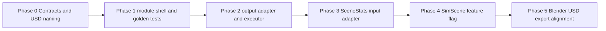

# Area Placement Methods — Migration Plan

Phased plan to integrate `proto/ps_asset_config.py` with SimWorld: parsed scene regions → layout JSON → asset placement in USD.

Use this document to track progress, record blockers, and link follow-up work. Prefer updating the **Progress** table over duplicating status elsewhere.

**Owner:** (unset)  
**Last updated:** 2026-06-03

---

## 1. Goals

1. Run the public-space pipeline (steps 1–5) from **parsed scene / region data**, not only hand-written proto JSON.
2. Keep the core algorithm in `area_placement_methods/module/`, with room to re-sync from `proto/` when the lab version changes.
3. Expose a stable API for `SimScene.prepare()` (and tests) without importing Isaac inside the algorithm module.
4. Document **adapter contracts** and **USD/Blender placeholder naming** so Blender export, parser, and layout stay aligned.
5. Apply layout output via a **placement executor** (real assets + **Dummy Obj** fallback for debug).

---

## 2. Current vs target

| Layer | Today | Target |
| --- | --- | --- |
| Parser | `placeholder_area_plaza_*` → mesh vertices → `SceneStats.placeholder_areas` | Rich region: type, outer ring, segments + `boundary_type`, ratio, optional `asset_has_set` |
| Layout | `scene_generator` → `generate_public_space_footprints_3d` (density grid) | `public_space_asset_configuration` steps 1–5 → `asset_list` |
| Apply | `AssetPlacementPlanner` + `SceneAssetAllocator` | Read placement plan JSON → map names to `AssetSpec` or Dummy → USD prims |

**Note:** Proto algorithm is largely implemented; the main integration risk is **input semantics** (segments, types) and **naming**, not rewriting steps 1–5.

---

## 3. Phased roadmap



### Phase 0 — Contracts and USD naming

**Deliverables**

- `docs/ADAPTER_CONTRACTS.md` — field mapping, units, frames, seed behavior
- `docs/USD_PLACEHOLDER_NAMING.md` — Blender/USD prim names, attributes, mesh/curve rules
- JSON schema IDs (documented, not necessarily JSON Schema files yet):
  - `simworld.region_input.v1` — parser / scene → algorithm
  - `simworld.placement_output.v1` — algorithm → executor

**Acceptance**

- Team agrees on one USD naming strategy (see §5).
- Every proto input field has a documented source (prim name, custom attr, or derived).

**Depends on:** none  

**Blocks:** Phase 3, Phase 5

---

### Phase 1 — Module shell and golden tests

**Deliverables**

```text
module/
  generator.py          # wrap public_space_asset_configuration (from proto)
  run.py                # CLI: input JSON, --steps, --seed, --output
  contracts/            # optional: example JSON for v1 schemas
```

- Copy or import logic from `proto/ps_asset_config.py` without changing step internals.
- `algorithm_lab` only: no `isaacsim` / `omni` / `pxr` imports.

**Acceptance**

- All 17 proto sample JSON files run steps `[1,2,3,4,5]` with fixed seed where applicable.
- Output contains expected top-level keys: `asset_list`, `walking_lines`, `dynamic_zones`, `static_zones`, etc.
- Failures are explicit validation errors, not silent empty `asset_list` (unless type rules say so, e.g. `city_street_roof`).

**Depends on:** Phase 0 (schema names only; can start with draft contracts)

---

### Phase 2 — Output adapter and placement executor

**Deliverables**

- `module/adapters/asset_list_to_plan.py` — proto `asset_list` → `simworld.placement_output.v1`
- `src/simworld/isaac_env/isaac_scene/public_space_placement_executor.py` (or equivalent)
- `dummy_asset_factory` — default cube/sphere or configurable `default_obj_usd`
- Asset name → `AssetSpec` mapping config (YAML/JSON under `assets/` or instance config)

**Acceptance**

- Given a frozen `placement_output.json`, executor creates N prims under `/World/GeneratedAssets/...` (Dummy mode).
- Missing library entry falls back to Dummy and logs a warning.
- Does not break existing `AssetPlacementPlanner` path when feature flag is off.

**Depends on:** Phase 1

---

### Phase 3 — SceneStats / region input adapter

**Deliverables**

- `module/adapters/scene_to_region_input.py` — `PlaceholderArea` (+ metadata) → `simworld.region_input.v1` / proto-shaped dict
- Unit tests with **synthetic** vertices (no USD), then one real mesh fixture when available

**Acceptance**

- At least one `public_space_type` (recommend `block_entrance`) round-trips: mock input → generator → non-empty `asset_list`.
- Segment list length and `boundary_type` values match spec for that fixture.

**Depends on:** Phase 0, Phase 1  

**Blocks:** Phase 4

---

### Phase 4 — SimScene integration

**Deliverables**

- `SimScene.prepare(..., layout_backend="legacy" | "area_placement_methods")`
- Optional CLI: `--layout-backend`, `--placement-plan`, `--use-dummy-assets`
- Wire: parse → adapter → generator → plan file or in-memory → executor

**Acceptance**

- `legacy` behavior unchanged for existing scenes.
- `area_placement_methods` + Dummy produces visible placeholders in Isaac run.
- Documented command in README / this plan §6.

**Depends on:** Phase 2, Phase 3

---

### Phase 5 — Blender / USD export alignment

**Deliverables**

- Blender export script or checklist matching `USD_PLACEHOLDER_NAMING.md`
- Extended `scene_parser` rules (and regex if needed) for new placeholder categories
- Sample USD scene in repo or documented path (small, no large binaries in git)

**Acceptance**

- One exported USD loads in SimWorld; parser fills new fields; full pipeline runs with `layout_backend=area_placement_methods`.

**Depends on:** Phase 0, Phase 4

---

## 4. Progress

| Phase | Title | Status | Started | Completed | Notes |
| --- | --- | --- | --- | --- | --- |
| 0 | Contracts and USD naming | done | 2026-06-03 | 2026-06-03 | `docs/ADAPTER_CONTRACTS.md`, `docs/USD_PLACEHOLDER_NAMING.md` |
| 1 | Module shell and golden tests | done | 2026-06-03 | 2026-06-03 | `module/`, `tests/test_area_placement_module.py` (16 proto JSON) |
| 2 | Output adapter and executor | done | 2026-06-03 | 2026-06-03 | Adapter + `public_space_placement_executor.py` (Dummy) |
| 3 | SceneStats input adapter | done | 2026-06-03 | 2026-06-03 | `public_space_region` adapter + synthetic block_entrance |
| 4 | SimScene feature flag | done | 2026-06-03 | 2026-06-03 | `layout_backend`, CLI flags, `scene_area_placement.py`, `area_placement_bridge.py` |
| 5 | Blender/USD export alignment | done | 2026-06-03 | 2026-06-03 | Parser rules + auto layout from `SceneStats`; `BLENDER_EXPORT_CHECKLIST.md` |

**Status values:** `planned` | `in-progress` | `blocked` | `done` | `deferred`

---

## 5. USD / parser naming (decision pending)

Current parser pattern (`scene_parser.py`):

```text
<mobility>_<domain>_<category>_<index>
```

`category` is `[a-zA-Z]+` only — **cannot** encode `city_street_roof` or `block_entrance` as a single token.

### Option A — Attributes on prims (recommended)

| Prim | Example name | Custom attributes |
| --- | --- | --- |
| Region root mesh | `placeholder_area_publicspace_001` | `public_space_type`, `ratio_dynamic_static` |
| Boundary segment | `placeholder_segment_001` (child) | `boundary_type`, `segment_id` |
| Existing asset set | `placeholder_assetset_arcadecolumn_001` | `asset_has_set_type`, geometry via mesh/curve |

Parser rules: new `ProcessingRule` entries + read attributes in adapter.

### Option B — Compressed category token

Example: `placeholder_area_blockentrance_001` + alias table in adapter.

**Action:** **Option A adopted** — documented in `docs/USD_PLACEHOLDER_NAMING.md` (2026-06-03).

---

## 6. Test plan

**Full-chain reference (inputs, visuals, acceptance rubric):** [docs/E2E_TEST_PLAN.md](docs/E2E_TEST_PLAN.md)

### L1 — Algorithm only (no Isaac)

```bash
cd algorithm_lab/experiments/area_placement_methods/module
python run.py ../proto/01_block_entrance_01.json --steps 1 2 3 4 5 --seed 42 -o ../../../outputs/area_placement_01.json
```

Checks:

- Exit code 0
- `asset_list` present; `public_space_type` preserved
- Optional: compare structure to `proto/out_test.json`

Batch (when `run.py` supports glob):

- All `proto/*.json` except `out_test.json`

### L2 — Unit tests (`tests/`, no Isaac)

| Test | Scope |
| --- | --- |
| `test_region_input_validation` | Minimal valid `region_input` dict |
| `test_asset_list_to_plan` | Fixed `asset_list` → placement plan fields |
| `test_scene_to_region_block_entrance` | Synthetic vertices + segments → proto dict |

Run from repo root:

```bash
PYTHONPATH=src/simworld python3 -m unittest discover -s tests -v -k area_placement
```

(Add tests when Phase 1–3 land.)

### L3 — Executor dry run

- Mock or minimal stage: prim paths and transforms only; Dummy asset path always succeeds.

### L4 — Isaac integration

```bash
scripts/run_sim.sh \
  --layout-backend area_placement_methods \
  --region-input-json algorithm_lab/experiments/area_placement_methods/proto/01_block_entrance_01.json \
  --use-dummy-public-space-assets true \
  --layout-output-dir outputs/area_placement \
  --sensor-profile none
```

Or apply a precomputed plan:

```bash
scripts/run_sim.sh \
  --layout-backend area_placement_methods \
  --placement-plan-json outputs/area_placement/placement_output.json \
  --use-dummy-public-space-assets true
```

Checks:

- Log line identifying layout backend
- Prim count under generated assets root matches plan length

### L5 — Visual (optional)

```bash
blender --python proto/blender_exporter.py -- path/to/placement_output.json
```

---

## 7. Adapter sketches (for Phase 0 doc expansion)

### `simworld.region_input.v1` (conceptual)

Maps to proto input; may be identical to proto JSON for debugging.

| Field | Source (target) |
| --- | --- |
| `public_space_type` | Prim attr or category alias |
| `public_space_geometry` | Region mesh boundary (closed LineString3D) |
| `public_space_segments` | Child segment prims or derived edges |
| `ratio_dynamic_static` | Prim attr or scene default |
| `asset_has_set` | Optional child prims |

### `simworld.placement_output.v1` (conceptual)

Derived from proto `asset_list` (+ metadata).

| Field | Source |
| --- | --- |
| `placements[]` | Each `asset_list` item |
| `placements[].asset_name` | `asset_candidates_name` |
| `placements[].position` | `asset_location` |
| `placements[].orientation` | `asset_orientation` |
| `placements[].zone_type` | `zone_type` |
| `placements[].source_region_id` | From parser index / prim path |

Executor maps `asset_name` → `AssetSpec.usd_path` or Dummy.

---

## 8. Open issues

| ID | Issue | Phase | Status |
| --- | --- | --- | --- |
| O-1 | Parser regex vs multi-word `public_space_type` | 0 | open |
| O-2 | How segments are authored in Blender (child curve vs mesh edges) | 0, 5 | open |
| O-3 | World vs local coordinates for exported meshes | 0, 3 | open |
| O-4 | `asset_URL` in proto is placeholder; map to real library paths | 2 | open |
| O-5 | Coexistence with `generate_public_space_footprints_3d` (feature flag) | 4 | open |
| O-6 | Promote `module/` to `src/simworld/engine/` — when stable | post-4 | open |

Add rows as discoveries occur; close with PR link or commit hash in **Notes**.

---

## 9. Design principles (carry through all phases)

1. **Algorithm lab isolation** — `module/` stays Isaac-free; only executor touches USD.
2. **Do not rewrite proto steps** — adapt at boundaries; re-sync from `proto/` when the lab algorithm updates.
3. **Explicit contracts** — versioned JSON IDs; document every adapter field.
4. **Reproducibility** — `seed` in region input and logged in placement output.
5. **Fail visible** — skip region with warning + `SceneStats`/`prepare` summary, do not crash entire scene for one bad mesh.

---

## 10. Changelog

| Date | Change |
| --- | --- |
| 2026-06-03 | Initial migration plan from architecture review session |
| 2026-06-03 | Phase 0–1 complete; Phase 2–3 partial (module, tests, executor stub) |
| 2026-06-03 | Phase 4 complete: SimScene + simulation CLI integration |
| 2026-06-03 | Phase 5 complete: scene_parser public-space prims + auto prepare path |
