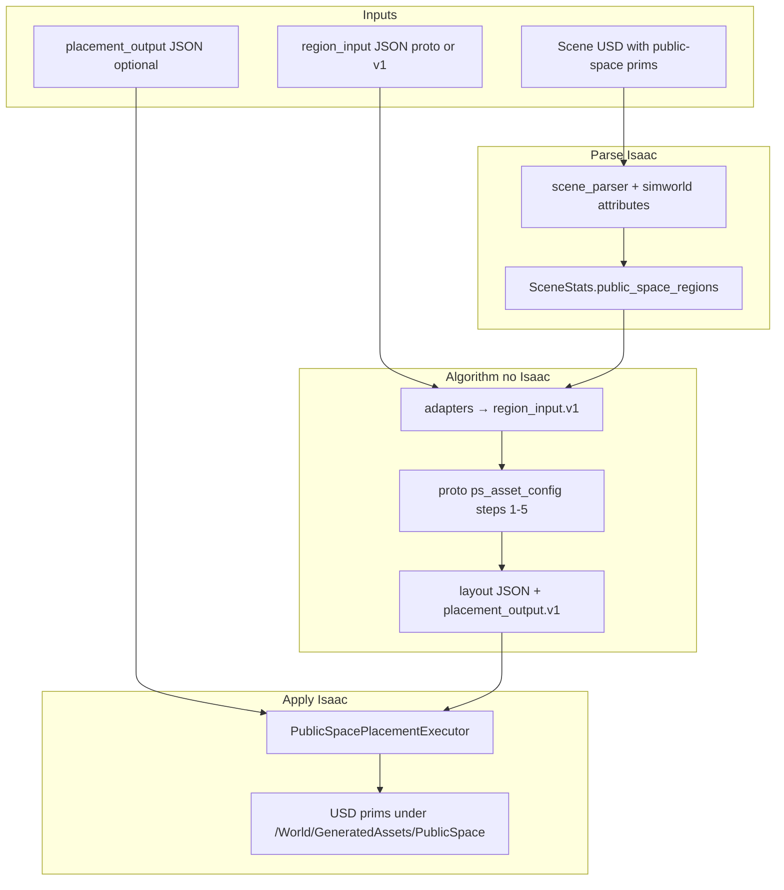

# Area Placement Methods — End-to-End Test Plan

Full-chain verification of the migrated public-space layout module: input requirements, commands, artifact checklist, and **expected visual / log outcomes** for comparing implementation quality.

Use this document as the acceptance reference when reviewing whether Phase 0–5 delivery meets intent.

**Related docs:** [ADAPTER_CONTRACTS.md](ADAPTER_CONTRACTS.md), [USD_PLACEHOLDER_NAMING.md](USD_PLACEHOLDER_NAMING.md), [BLENDER_EXPORT_CHECKLIST.md](BLENDER_EXPORT_CHECKLIST.md), [../MIGRATION_PLAN.md](../MIGRATION_PLAN.md)

---

## 1. Pipeline under test



**Three entry paths (all must be testable):**

| ID | Path | When to use |
| --- | --- | --- |
| **P1** | JSON → layout → apply | Lab golden / CI algorithm regression |
| **P2** | USD parse → layout → apply | Production-like Blender export |
| **P3** | placement_output only → apply | Replay frozen plan; isolate executor |

**Baseline comparison:** legacy `layout_backend=legacy` uses `placeholder_area_plaza_*` grid footprints — different algorithm, not byte-identical to area placement.

---

## 2. Input data requirements

### 2.1 Common conventions

| Item | Requirement |
| --- | --- |
| Units | Meters |
| Frame | World XYZ, Z up (same as `scene_parser` mesh vertices) |
| `public_space_type` | One of: `block_entrance`, `city_street_roof`, `city_street_roofless`, `city_yard_roof`, `city_yard_roofless`, `building_entrance` |
| `ratio_dynamic_static` | Float in `[0.0, 1.0]` |
| Outer boundary | Closed `LineString3D` (first point may repeat at end) |
| Each segment | Exactly **2** endpoints; `boundary_type` from proto enum |
| Coordinates | Coplanar for best results (algorithm uses rectangle/bbox logic) |

### 2.2 Path P1 — Region input JSON

**File:** proto-shaped JSON or `simworld.region_input.v1` (see `module/contracts/region_input.example.json`).

**Minimum required fields:**

```json
{
  "public_space_type": "block_entrance",
  "public_space_geometry": { "type": "LineString3D", "coordinates": [[...]] },
  "public_space_segments": [
    { "segment_id": 1, "geometry": { "type": "LineString3D", "coordinates": [[x,y,z],[x,y,z]] }, "boundary_type": "..." }
  ],
  "ratio_dynamic_static": 0.7
}
```

**Recommended golden sample (repo):**

`algorithm_lab/experiments/area_placement_methods/proto/01_block_entrance_01.json`

- 10 m × 10 m square, `ratio_dynamic_static: 0.7`
- 4 segments with types matching `sample_data.md` first block_entrance example

**Batch regression:** all `proto/0*.json` … `17_*.json` (16 files); expect `city_street_roof` → **0 assets** by design.

### 2.3 Path P2 — Scene USD

**Scene:** Any USD loadable by `scripts/run_sim.sh` (default or `--scene-usd`).

**Required prims per public-space instance:**

| Prim | Name pattern | Custom attributes |
| --- | --- | --- |
| Region root | `placeholder_area_publicspace_<index>` | `simworld:public_space_type`, `simworld:ratio_dynamic_static` |
| Segment (child) | `placeholder_segment_edge_<index>` | `simworld:segment_id`, `simworld:boundary_type` |
| Asset-has-set (optional) | `placeholder_assetset_line_<index>` | `simworld:asset_has_set_id`, `simworld:asset_has_set_type` |

**Geometry:**

- Region: mesh with ≥ 3 boundary vertices (quad recommended).
- Segment: mesh/curve whose world vertices define a line (2 unique points after dedupe).
- Segment prims must be **under** the region prim in the hierarchy (parent path used for linking).

**Without USD in repo:** author in Blender per [BLENDER_EXPORT_CHECKLIST.md](BLENDER_EXPORT_CHECKLIST.md), or temporarily use P1 JSON until a test USD is committed.

### 2.4 Path P3 — Placement output JSON only

**File:** `simworld.placement_output.v1` (see `module/contracts/placement_output.example.json`).

**Required:**

- `schema_version`: `simworld.placement_output.v1`
- `placements[]`: each with `asset_name`, `position` [x,y,z], optional `orientation`

Generate once via P1:

```bash
python3 algorithm_lab/experiments/area_placement_methods/module/run.py \
  algorithm_lab/experiments/area_placement_methods/proto/01_block_entrance_01.json \
  --steps 1 2 3 4 5 \
  --to-placement-output outputs/area_placement/golden_01.plan.json
```

---

## 3. Test matrix (full functionality)

Run in order; later steps assume earlier ones pass.

| Step | ID | Environment | What it proves |
| --- | --- | --- | --- |
| 1 | T1 | Host Python | Unit tests + proto batch |
| 2 | T2 | Host Python | Adapter: parsed region dict ≡ proto 01 |
| 3 | T3 | Host Python | CLI `run.py` + placement_output schema |
| 4 | T4 | Isaac | P1 JSON full chain + Dummy prims |
| 5 | T5 | Isaac | P3 plan-only chain |
| 6 | T6 | Isaac | P2 USD parse auto chain |
| 7 | T7 | Isaac | Legacy vs new backend A/B |
| 8 | T8 | Blender optional | Visual debug of layout JSON |

---

## 4. Commands and pass criteria

### T1 — Automated tests (no Isaac)

```bash
cd /home/fangzhou/projects/LC_01
scripts/run_tests.sh
# or:
PYTHONPATH=src/simworld python3 -m unittest \
  tests.test_area_placement_module \
  tests.test_area_placement_bridge \
  tests.test_public_space_parsed_region -v
```

**Pass:** exit 0; ≥ 9 tests in area-placement group; full suite currently 70 tests.

---

### T2 — Golden algorithm output (`01_block_entrance_01.json`)

```bash
python3 algorithm_lab/experiments/area_placement_methods/module/run.py \
  algorithm_lab/experiments/area_placement_methods/proto/01_block_entrance_01.json \
  --steps 1 2 3 4 5 \
  -o outputs/area_placement/golden_01_layout.json \
  --to-placement-output outputs/area_placement/golden_01.plan.json
```

**Expected summary (stdout):**

| Field | Expected value |
| --- | --- |
| `public_space_type` | `block_entrance` |
| `asset_count` | **3** |
| `walking_line_count` | **2** |
| `dynamic_zone_count` | **3** |
| `static_zone_count` | **4** |

**Expected `asset_list` names (order may vary):**

- `bollard`
- `traffic_light_vehicle`
- `traffic_light_pedestrian`

**Expected `flow_pattern`:** `cross`

**Fail if:** `asset_count` is 0; missing `walking_lines` / zones; exception during steps 1–5.

---

### T3 — All proto samples (regression)

```bash
for f in algorithm_lab/experiments/area_placement_methods/proto/[0-9]*.json; do
  [[ "$(basename "$f")" == "out_test.json" ]] && continue
  python3 algorithm_lab/experiments/area_placement_methods/module/run.py "$f" --steps 1 2 3 4 5 -o /tmp/out.json || echo FAIL "$f"
done
```

**Pass rules per file:**

| `public_space_type` | `asset_count` |
| --- | --- |
| `city_street_roof` | **0** |
| All other types in batch | **≥ 1** |

---

### T4 — Isaac P1: JSON → layout → Dummy in scene

**Prerequisites:** Isaac Sim `ISAAC_PYTHON`, scene USD opens (default `test_simple_city.usd` or your block).

```bash
scripts/run_sim.sh \
  --layout-backend area_placement_methods \
  --region-input-json algorithm_lab/experiments/area_placement_methods/proto/01_block_entrance_01.json \
  --use-dummy-public-space-assets true \
  --public-space-dummy-size-m 0.5 \
  --layout-output-dir outputs/area_placement/run_p1 \
  --skip-legacy-placeholder-areas true \
  --sensor-profile none
```

**Expected console (prepare phase):**

```text
[INFO] Area placement: 3 prim(s), backend=area_placement_methods, dummy=True
[OK] Applied 3 public-space placement(s) under /World/GeneratedAssets/PublicSpace.
```

**Expected files:**

| Path | Content |
| --- | --- |
| `outputs/area_placement/run_p1/placement_output.json` | `placements.length == 3` |
| Same layout fields as T2 golden | `asset_name` matches golden plan |

**Expected viewport (Isaac):**

- **3 gray/colored cubes** (0.5 m) near the 10×10 m region implied by JSON coordinates.
- Positions in **world space** around (0–10, 0–10, z≈0) — may be offset if scene origin differs; compare **relative** spacing, not absolute world lock unless scene shares origin.
- **No** new prims under legacy `/World/GeneratedAssets` from plaza grid when `--skip-legacy-placeholder-areas true`.

**Stage tree (UsdView / Isaac Stage):**

```text
/World/GeneratedAssets/PublicSpace/
  asset_0001/   (or similar placement_id)
    DummyGeom   (UsdGeom.Cube)
  asset_0002/
    DummyGeom
  asset_0003/
    DummyGeom
```

**Fail if:** warning skips placement; 0 prims; crash; prim count ≠ 3.

---

### T5 — Isaac P3: plan replay only

Run T4 once, then:

```bash
scripts/run_sim.sh \
  --layout-backend area_placement_methods \
  --placement-plan-json outputs/area_placement/run_p1/placement_output.json \
  --use-dummy-public-space-assets true \
  --skip-legacy-placeholder-areas true \
  --sensor-profile none
```

**Pass:** Same **3** Dummy prims and same approximate positions as T4 (deterministic plan file).

**Proves:** executor + loader independent of layout generator.

---

### T6 — Isaac P2: USD-driven auto chain

**Input:** Scene USD containing one `placeholder_area_publicspace_001` + 4× `placeholder_segment_edge_*` matching `01_block_entrance_01` geometry and attributes (see Blender checklist).

```bash
scripts/run_sim.sh \
  --scene-usd /path/to/your_public_space_test.usd \
  --layout-backend area_placement_methods \
  --use-dummy-public-space-assets true \
  --layout-output-dir outputs/area_placement/run_p2 \
  --skip-legacy-placeholder-areas true \
  --sensor-profile none
```

**Expected console:**

```text
Public-space regions: 1
  /World/.../placeholder_area_publicspace_001 type=block_entrance segments=4 asset_has_set=0
[INFO] Built placement plan from 1 parsed public-space region(s)
[INFO] Area placement: 3 prim(s), ...
```

**Expected visual:** Same as T4 (3 dummies), placed relative to **region mesh location in your scene** (not necessarily 0–10 world origin).

**Fail if:**

- `Public-space regions: 0` → naming/attributes/hierarchy wrong.
- `segments=0` → segment prims not children or missing `simworld:boundary_type`.
- Parse warnings listed under `Public-space parse warnings`.

---

### T7 — A/B: legacy vs area placement

**A — Legacy (plaza grid):**

```bash
scripts/run_sim.sh \
  --layout-backend legacy \
  --sensor-profile none
```

**Expected:** Multiple assets under `/World/GeneratedAssets/` from `placeholder_area_plaza_*` meshes; **density grid** footprints, not proto asset names.

**B — New module:**

Use T4 or T6.

**Comparison intent:**

| Aspect | Legacy | area_placement_methods |
| --- | --- | --- |
| Trigger | `placeholder_area_plaza_*` | `publicspace` prims or JSON |
| Algorithm | `generate_public_space_footprints_3d` | 5-step proto pipeline |
| Asset identity | Library category match | Named candidates (`bollard`, …) |
| Debug shape | Library meshes | Dummy cubes (default) |
| Zones / flow | Not modeled | In layout JSON (`walking_lines`, zones) |

---

### T8 — Blender visualization (optional, no Isaac)

From layout JSON produced in T2:

```bash
blender --python algorithm_lab/experiments/area_placement_methods/proto/blender_exporter.py -- \
  outputs/area_placement/golden_01_layout.json
```

**Expected visual (Blender):**

| Layer | Appearance |
| --- | --- |
| Segments | Colored strips by priority |
| People points | Spheres |
| Walking lines | White/cyan curves (main vs secondary) |
| Dynamic zones | Orange translucent patches |
| Static zones | Blue translucent patches |
| Assets | Red flat quads at placements |

Use to **validate algorithm geometry** before Isaac placement.

---

## 5. Artifact checklist (save for each test run)

| Artifact | Path pattern | Used for |
| --- | --- | --- |
| Layout JSON | `outputs/area_placement/*/golden_01_layout.json` | T8 Blender, diff vs golden |
| Placement plan | `outputs/area_placement/*/placement_output.json` | T5 replay, prim count |
| Console log | copy terminal | parser warnings, prim counts |
| Screenshot | Isaac viewport | cube count/positions |
| Stage export | optional USDA snippet | prim paths under `PublicSpace` |

**Quick JSON checks:**

```bash
python3 -c "
import json, sys
p=sys.argv[1]
d=json.load(open(p))
pl=d.get('placements', d.get('asset_list',[]))
print('count', len(pl))
print('names', [x.get('asset_name') or x.get('asset_candidates_name') for x in pl])
" outputs/area_placement/run_p1/placement_output.json
```

---

## 6. Evaluation rubric (落实效果)

Score each dimension **0–2** (0 missing, 1 partial, 2 meets spec).

| # | Dimension | 2 = Good |
| --- | --- | --- |
| E1 | Algorithm fidelity | T2/T3 match golden counts and asset names for `01_block_entrance_01` |
| E2 | Contract stability | `placement_output.json` loads; schema_version correct |
| E3 | Isaac apply | T4/T5: 3 Dummy prims, no crash |
| E4 | USD parse path | T6: regions≥1, segments=4, auto plan built |
| E5 | Coexistence | T7: legacy unchanged when `layout_backend=legacy` |
| E6 | Observability | Logs show backend, region count, placement count |
| E7 | Documentation | Operator can follow this doc without asking implementation details |

**Release bar:** E1–E3 ≥ 2; E4 ≥ 1 (USD sample may be external); E5–E7 ≥ 1.

---

## 7. Known limitations (do not fail test for these)

- Dummy cubes are **not** final art; only pose/debug placeholders.
- `asset_URL` in proto is fake; real meshes need `--public-space-asset-name-map`.
- JSON P1 places in **input coordinates**; scene origin offset is normal.
- `city_street_roof` intentionally places **zero** assets.
- Algorithm uses rectangle/bbox approximations; non-rectangular regions may differ from Blender idealization.
- Segment inference from messy meshes may need cleaner Blender export.

---

## 8. Troubleshooting

| Symptom | Likely cause | Action |
| --- | --- | --- |
| `requires --region-input-json` | No USD public-space prims | Use P1 JSON or fix T6 USD |
| `Public-space regions: 0` | Wrong prim names / missing attrs | [USD_PLACEHOLDER_NAMING.md](USD_PLACEHOLDER_NAMING.md) |
| `segments=0` | Segments not parented under region | Fix hierarchy |
| `0 prim(s)` applied | Empty plan or schema error | Check `placement_output.json` count |
| Cubes far from expected | Scene vs JSON coordinate frames | Compare spacing; align scene origin |
| Legacy still spawns assets | `skip-legacy-placeholder-areas false` | Set true for pure A/B |
| Import error `isaacsim` in tests | Ran scene_parser test without Isaac | Use `tests.test_*area_placement*` only on CI |

---

## 9. Suggested test report template

```markdown
## Area placement E2E — YYYY-MM-DD

- Tester / Isaac build:
- Scene USD:
- Path: P1 / P2 / P3

### Results
| Step | Pass? | Notes |
| T1 | | |
| T2 | asset_count= | |
| T4 | prim count= | screenshot: |
| T6 | regions= segments= | |

### Visual vs expected
- Cube count:
- Relative layout OK?
- Blender zones (T8) OK?

### Score E1–E7: /14
```

---

## Changelog

| Date | Change |
| --- | --- |
| 2026-06-03 | Initial full-chain E2E plan with golden `block_entrance` expectations |
