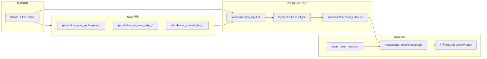

# 公共空间排布：场景输入与资产库指导手册

本文档是 **area_placement_methods** 后端的全覆盖参考，面向场景编辑（Blender → USD）、JSON 调试输入、以及 Isaac 运行时资产映射。实现以仓库当前代码为准：

| 组件 | 路径 |
| --- | --- |
| 算法（step 1–5） | `proto/ps_asset_config.py` |
| 对接器 | `module/adapters/public_space_region.py`, `asset_list_to_plan.py` |
| USD 解析 | `src/simworld/isaac_env/isaac_scene/scene_parser.py` |
| 执行器 | `src/simworld/isaac_env/isaac_scene/public_space_placement_executor.py` |
| 契约 | `docs/ADAPTER_CONTRACTS.md` |

**相关短文：** [USD_PLACEHOLDER_NAMING.md](USD_PLACEHOLDER_NAMING.md)、[BLENDER_EXPORT_CHECKLIST.md](BLENDER_EXPORT_CHECKLIST.md)、[ADAPTER_CONTRACTS.md](ADAPTER_CONTRACTS.md)、[docs/USD_SCENE_AUDIT.md](../../../docs/USD_SCENE_AUDIT.md)

---

## 目录

1. [数据流总览](#1-数据流总览)
2. [第一部分：场景输入与对接器](#第一部分场景输入与对接器)
3. [第二部分：资产库与运行时映射](#第二部分资产库与运行时映射)
4. [校验与调试工具](#校验与调试工具)
5. [附录：快速检查表](#附录快速检查表)

---

## 1. 数据流总览



**三种启动方式（任选其一，不要混用同区域的重复源）：**

| 方式 | 入口 | 适用 |
| --- | --- | --- |
| A. USD 自动 | 加载 `--scene-usd`，`--layout-backend area_placement_methods` | 生产场景 |
| B. 区域 JSON | `--region-input-json path/to/region.json` | 算法调试、金样例 |
| C. 预计算 plan | `--placement-plan-json path/to/placement_output.json` | 只验证执行器 |

---

# 第一部分：场景输入与对接器

## 1.1 算法在算什么（step 1–5）

`public_space_asset_configuration()` 按步骤修改/填充中间结果，最终 step 5 产出 `asset_list`。

| Step | 名称 | 主要输入 | 主要输出 |
| --- | --- | --- | --- |
| 1 | 边段优先级与可步行性 | `public_space_segments[].boundary_type` | 每段 `priority`, `walkable` |
| 2 | 人行点 | 段几何、`asset_has_set`（柱廊等） | `people_points` |
| 3 | 流线 | `public_space_type`、人行点 | `flow_pattern`, `walking_lines` |
| 4 | 动/静分区 | `ratio_dynamic_static`、流线 | `dynamic_zones`, `static_zones` |
| 5 | 资产落位 | 分区、嵌入候选库 | `asset_list` |

**仅 `city_street_roof` 在 step 5 故意返回空列表**（无街道家具）。其它类型若 `asset_list` 为空，对接器可能注入调试用 `isaac_builtin_placeholder`（见 ADAPTER_CONTRACTS）。

---

## 1.2 逻辑输入：`simworld.region_input.v1`

与 proto JSON、`public_space_asset_configuration()` 参数对齐。示例：`module/contracts/region_input.example.json`。

### 1.2.1 顶层字段

| 字段 | 类型 | 必填 | 说明 |
| --- | --- | --- | --- |
| `schema_version` | string | **是** | 固定 `simworld.region_input.v1` |
| `region_id` | string | **是** | 稳定 ID（prim 名或路径） |
| `public_space_type` | enum | **是** | [§1.3.1](#131-public_space_type公共空间类型) |
| `public_space_geometry` | LineString3D | **是** | 闭合外轮廓，世界坐标，单位米 |
| `public_space_segments` | array | **是** | ≥3 段（矩形通常 4），见 [§1.3.2](#132-boundary_type边界类型) |
| `ratio_dynamic_static` | number | **是** | `[0.0, 1.0]`，动区面积目标比例 |
| `cover_geometry` | LineString3D | 否 | 顶棚/覆盖轮廓 |
| `asset_has_set` | array | 否 | 预置障碍（柱廊等），[§1.3.4](#134-asset_has_set预置障碍集) |
| `metadata` | object | 否 | 如 `source_prim_path`, `coordinate_frame` |

### 1.2.2 几何：`LineString3D`

| 属性 | 要求 |
| --- | --- |
| `type` | 必须为 `"LineString3D"` |
| `coordinates` | `[[x,y,z], ...]`，右手系，**Z 向上**，单位 **米** |
| 区域环 | 建议首尾重复同一点闭合；对接器会 CCW 排序并闭合 |
| 边段 | **恰好 2 个顶点**（线段端点）；薄四边形 mesh 会被抽成最远两点 |

### 1.2.3 边段对象

| 字段 | 类型 | 必填 |
| --- | --- | --- |
| `segment_id` | int | **是**（建议 1…N 连续） |
| `geometry` | LineString3D（2 点） | **是** |
| `boundary_type` | enum | **是** |

---

## 1.3 枚举与语义

### 1.3.1 `public_space_type`（公共空间类型）

| 值 | step 5 资产 | 典型流线（step 3） |
| --- | --- | --- |
| `block_entrance` | 有（路桩、信号灯等） | 固定 `cross` |
| `building_entrance` | 有 | fishbone / ring / orthogonal |
| `city_street_roofless` | 有（专用规则 + 通用候选） | 倾向 `fishbone` |
| `city_yard_roof` | 有 | 非 fishbone 时多模式 |
| `city_yard_roofless` | 有 | 非 fishbone 时多模式 |
| `city_street_roof` | **无（0 个）** | — |

**无效示例（会导致 0 资产或解析拒绝）：** 属性名当值，如 `"simworld:public_space_type"`。

### 1.3.2 `boundary_type`（边界类型）

用于 step 1 优先级与可步行性（`proto/function definition.md`）。

| 值 | priority | walkable |
| --- | ---: | --- |
| `block_entrance` | 0 | 是 |
| `building_entrance_main` | 0 | 是 |
| `street_boundary_primary` | 2 | 是 |
| `yard_boundary` | 4 | 是 |
| `block_boundary_secondary` | 4 | 是 |
| `block_boundary_primary` | 6 | 是 |
| `street_boundary_secondary` | 6 | 是 |
| `building_other_type` | 8 | 是 |
| `block_boundary_other` | 8 | 是 |
| `building_wall` | 15 | **否** |
| `block_other_type` | 10（默认回退） | 是 |
| `building_other_type` | 8 | 是 |

编辑时应用 **真实语义**（临街 / 地块 / 建筑侧），不要四条边全部填同一类型，否则流线与金样例 `01_block_entrance_01.json` 会不一致。

### 1.3.3 `flow_pattern`（算法输出，可选覆盖）

| 值 | 含义 |
| --- | --- |
| `cross` | 十字主廊（block_entrance） |
| `fishbone` | 鱼骨 |
| `ring` | 绕障或绕环 |
| `orthogonal` | 正交折线主廊 |

CLI 调试：`module/run.py` 或 proto CLI 的 `--flow_pattern` 可覆盖自动选择。

### 1.3.4 `asset_has_set`（预置障碍集）

| 字段 | 类型 | 必填 |
| --- | --- | --- |
| `asset_has_set_id` | int | **是** |
| `asset_has_set_type` | enum | **是** |
| `geometry` | LineString3D | **是**（折线/柱列路径） |

**当前实现中算法显式识别的类型：**

| `asset_has_set_type` | 作用 |
| --- | --- |
| `arcade_column` | 影响人行点（1 m 内投影切分）、ring 流线绕障 |

其它字符串可写入 JSON，但 step 2/3 可能按通用障碍处理；扩充类型需改 `ps_asset_config.py`。

### 1.3.5 分区与落位（输出侧枚举）

| 字段 | 值 |
| --- | --- |
| `zone_type`（`asset_list` / placement） | `dynamic`, `static` |
| 调试回退 | `fallback` |
| 候选 `preferred_zone` | `dynamic`, `static` |

---

## 1.4 USD 场景输入（Blender → USD）

命名规则与 `scene_parser.NAME_PATTERN` 一致：

```text
<mobility>_<domain>_<category>_<index>
```

- `mobility`, `domain`, `category`：仅字母 `[a-zA-Z]+`
- `index`：字母数字 `[0-9a-zA-Z]+`
- **不能**把 `city_street_roof` 塞进单个 `category`（须用属性 `simworld:public_space_type`）

### 1.4.1 公共空间区域（必填）

| 项 | 值 |
| --- | --- |
| **Prim 名称** | `placeholder_area_publicspace_<index>` |
| **示例** | `placeholder_area_publicspace_001` |
| **层级** | 建议 Xform + 子 Mesh（或单 Mesh） |
| **父级** | 场景根或任意 Xform 下 |

**USD / Blender 自定义属性（导出为 prim 属性）：**

| 属性名 | 类型 | 必填 | 合法值 |
| --- | --- | --- | --- |
| `simworld:public_space_type` | string / token | **是** | [§1.3.1](#131-public_space_type公共空间类型) 之一 |
| `simworld:ratio_dynamic_static` | float | **是** | `0.0` … `1.0`（如 `0.7`） |
| `simworld:region_id` | string | 否 | 默认可用 prim 名 |

**几何：** 区域 mesh 在世界空间至少 **3 个共面顶点**（通常 4 角 + 闭合）；导出前 **应用缩放**。

**常见错误：** 自定义属性 **名称** 写对，**值** 仍默认为 `simworld:public_space_type` 字符串 → 解析/算法失败。应用 **值** `block_entrance` 等。

### 1.4.2 边界边段（必填，区域子物体）

| 项 | 值 |
| --- | --- |
| **Prim 名称** | `placeholder_segment_edge_<index>` |
| **父级** | **必须** 在对应 `placeholder_area_publicspace_*` 下 |

| 属性名 | 类型 | 必填 | 合法值 |
| --- | --- | --- | --- |
| `simworld:segment_id` | int | **是** | 如 `1`, `2`, `3`, `4` |
| `simworld:boundary_type` | string | **是** | [§1.3.2](#132-boundary_type边界类型) |

**几何：** 线段 **2 个端点**（可用薄 quad mesh，解析器取最远两点）。

### 1.4.3 预置障碍线（可选）

| 项 | 值 |
| --- | --- |
| **Prim 名称** | `placeholder_assetset_line_<index>` |
| **父级** | 区域根下 |

| 属性名 | 类型 | 必填 | 合法值 |
| --- | --- | --- | --- |
| `simworld:asset_has_set_id` | int | **是** | |
| `simworld:asset_has_set_type` | string | **是** | 推荐 `arcade_column` |

### 1.4.4 与排布无关的 USD 内容（可保留，解析器忽略）

| 类型 | 示例 | pipeline |
| --- | --- | --- |
| 灯光 | `DomeLight`, `env_light` | unrelated |
| 材质 / Shader | `_materials`, `Principled_BSDF` | unrelated |
| 区域/边段下的可视 Mesh | `Plane_001`, `Plane_002` | unrelated（几何由父 Xform 下 mesh 抽取） |
| 静态地面 | `static_ground_*` | static_scene（碰撞，不参与 area placement） |
| 旧版广场占位 | `placeholder_area_plaza_*` | legacy_placement（需 `layout_backend=legacy`） |
| 行人/车辆占位 | `placeholder_pedestrian_*`, `placeholder_vehicle_*` | dynamic_agents |

---

## 1.5 对接器映射表

### USD → `region_input`（`public_space_region_to_region_input`）

| region_input | USD 来源 |
| --- | --- |
| `region_id` | prim 路径或 `raw_name` |
| `public_space_type` | `simworld:public_space_type` |
| `ratio_dynamic_static` | `simworld:ratio_dynamic_static` 或默认 `0.36` |
| `public_space_geometry` | 区域 mesh 顶点 → 闭合 `LineString3D` |
| `public_space_segments[]` | 子 prim `placeholder_segment_edge_*` |
| `asset_has_set[]` | 子 prim `placeholder_assetset_line_*` |

### layout → `placement_output`（`layout_result_to_placement_output`）

| placement_output | proto `asset_list` |
| --- | --- |
| `placements[].asset_name` | `asset_candidates_name` |
| `placements[].position` | `asset_location` |
| `placements[].orientation` | `asset_orientation` |
| `placements[].zone_type` / `zone_id` | 同名字段 |
| `placements[].asset_url` | `asset_URL`（占位 URL，执行器可不使用） |

---

## 1.6 编辑用层级模板（Blender）

```text
placeholder_area_publicspace_001          # simworld:public_space_type, ratio_dynamic_static
├── placeholder_segment_edge_001        # segment_id, boundary_type, 2-pt mesh
├── placeholder_segment_edge_002
├── placeholder_segment_edge_003
├── placeholder_segment_edge_004
└── placeholder_assetset_line_001       # 可选：arcade_column
```

金样例坐标见 `proto/01_block_entrance_01.json` 与 [MINIMAL_BLENDER_TEST_SCENE.md](MINIMAL_BLENDER_TEST_SCENE.md)。

---

## 1.7 嵌入资产候选库（算法内部，非场景文件）

step 5 默认使用 `ps_asset_config.py` 内 `EMBEDDED_ASSET_CANDIDATES`，**不要求**在 region JSON 里提供 `asset_candidates_list`。扩充新资产类型需修改该列表并同步 [第二部分](#第二部分资产库与运行时映射) 的 name map。

| `asset_candidates_name` | `applicable_types` | `preferred_zone` | 备注 |
| --- | --- | --- | --- |
| `bollard` | block_entrance | static | |
| `traffic_light_vehicle` | block_entrance | static | |
| `traffic_light_pedestrian` | block_entrance | static | |
| `metro_sign` | block_entrance | static | prob 0.5 |
| `vending_machine` | building_entrance, city_yard_roof | static | |
| `smart_locker` | building_entrance | static | |
| `entrance_canopy` | building_entrance | static | |
| `guangzhou_bus_stop` | city_street_roofless | static | |
| `shared_bike_parking` | city_street_roofless | static | |
| `tree_pool` | city_street_roofless, city_yard_roofless | static | |
| `flower_box` | city_street_roofless, city_yard_roofless | static | |
| `guard_rail` | city_street_roofless, city_yard_roofless | static | |
| `street_light` | city_street_roofless, city_yard_roofless | static | |
| `trash_bin` | city_street_roofless, city_yard_roofless | static | |
| `fire_hydrant` | city_street_roofless, city_yard_roofless | static | |
| `long_bench` | city_yard_roofless, city_yard_roof | static | |
| `seat_group` | city_yard_roofless, city_yard_roof | static | |
| `food_cart` | city_yard_roofless, city_yard_roof | dynamic | |
| `sculpture` | city_yard_roofless | static | 需中央静区 |
| `grass_patch` | city_yard_roofless | static | |

候选字段说明：

| 字段 | 含义 |
| --- | --- |
| `asset_geometry_size` | `[长, 宽]` 米，占位 footprint |
| `probability` / `probability_by_type` | 放置概率 |
| `max_count` | 该候选最多放置次数 |
| `requires_central_static_zone` | 仅 `sculpture`：需中央静区 |

---

# 第二部分：资产库与运行时映射

排布算法只输出 **逻辑名**（`asset_candidates_name` + 世界位姿）。在 Isaac 中显示真实模型需要 **第二条映射链**（与 legacy `assets/library` 扫描分离）。

## 2.1 两套资产体系对比

| 体系 | 用于 | 目录 / 文件 | 匹配键 |
| --- | --- | --- | --- |
| **公共空间 name map** | `area_placement_methods` | `asset_name_map.json` | `asset_candidates_name` → `.usd` 绝对路径 |
| **Legacy AssetLibrary** | `layout_backend=legacy`（广场网格） | `assets/library/<category>/*.usd` | footprint **category** = 父文件夹名 |

本手册 **§2.2–2.4** 针对 area placement；legacy 见仓库根 `README.md`。

## 2.2 `simworld.asset_name_map.v1`

示例：`module/contracts/asset_name_map.example.json`

```json
{
  "schema_version": "simworld.asset_name_map.v1",
  "assets": {
    "bollard": "/absolute/path/to/assets/public_space/bollard/bollard_01.usd",
    "traffic_light_vehicle": "/absolute/path/to/.../traffic_light_vehicle.usd"
  }
}
```

| 规则 | 说明 |
| --- | --- |
| **Key** | 必须与 [§1.7](#17-嵌入资产候选库算法内部非场景文件) 中 `asset_candidates_name` **完全一致**（蛇形命名） |
| **Value** | 单个 USD 文件 **绝对路径**；文件须存在，否则回退 Dummy |
| **未列出名称** | 仍放置：使用 **UsdGeom Cube**（`--use-dummy-public-space-assets true`，默认） |
| **调试占位** | `isaac_builtin_placeholder` 无需入库 |

**Isaac CLI：**

```bash
scripts/run_sim.sh \
  --layout-backend area_placement_methods \
  --use-dummy-public-space-assets false \
  --public-space-asset-name-map /path/to/asset_name_map.json \
  --scene-usd ...
```

生成根 prim：`/World/GeneratedAssets/PublicSpace/<placement_id>/`（引用或 `DummyGeom`）。

## 2.3 推荐资产库目录结构（物理文件）

算法不扫描此结构；便于团队协作与生成 name map：

```text
assets/
└── public_space/                    # 逻辑分组（任意，非自动扫描）
    ├── bollard/
    │   └── bollard_01.usd           # 原点在锚点，Z-up，尺寸接近 asset_geometry_size
    ├── traffic_light_vehicle/
    │   └── traffic_light_vehicle_01.usd
    ├── traffic_light_pedestrian/
    ├── tree_pool/
    └── ...
```

**建模建议：**

| 项 | 建议 |
| --- | --- |
| 单位 | 米，与 stage `metersPerUnit=1` 一致 |
| 朝向 | 默认面向 +X；执行器用 `orientation` XY 算 yaw |
| 尺度 | 参考 §1.7 `asset_geometry_size`；暂无自动缩放 |
| 锚点 | 模型原点 = 落位点（脚底/杆件中心） |
| 格式 | `.usd` / `.usda` / `.usdc` |

可用脚本维护 map（示例思路）：

```bash
# 伪代码：对每个 *.usd 生成 map 条目，key=父目录名或 manifest 中的 candidates_name
```

## 2.4 扩充新资产（端到端清单）

1. **算法侧：** 在 `EMBEDDED_ASSET_CANDIDATES` 增加条目（`asset_candidates_name`, `applicable_types`, `probability`, …）。
2. **场景侧：** 无需改 USD 命名；类型由 `public_space_type` 决定候选池。
3. **库侧：** 制作 USD，加入 `asset_name_map.json`。
4. **验证：**
   - 无 Isaac：`module/run.py <region.json> --steps 1 2 3 4 5 --to-placement-output out.json`
   - 有 Isaac：`--use-dummy-public-space-assets false` + name map。
5. **测试：** `PYTHONPATH=src/simworld python3 -m unittest tests.test_area_placement_module -v`

## 2.5 Legacy `assets/library`（仅供参考）

```text
assets/library/
├── bench/
│   └── bench_01.usd
├── tree/
│   └── tree_01.usd
```

`AssetLibrary.scan_folder()`：**父目录名 = category**。仅当 `layout_backend=legacy` 且未 `--skip-legacy-placeholder-areas` 时用于 `placeholder_area_plaza_*` 等。

**不要**把动态行人资产放在此树下（见 `doc/DynamicAgents.md`）。

## 2.6 输出契约：`simworld.placement_output.v1`

执行器输入；可由布局自动生成或手写调试。

| 字段 | 必填 |
| --- | --- |
| `schema_version` = `simworld.placement_output.v1` | 是 |
| `placements[]` | 是（可为空仅 `city_street_roof`） |
| `placements[].placement_id`, `asset_name`, `position` | 是 |

`asset_url` 可保留；真实网格以 **name map** 为准。

---

# 校验与调试工具

| 工具 | 命令 | 作用 |
| --- | --- | --- |
| USD 结构审计 | `scripts/audit_scene_usd.sh --usd scene.usd -o report.md` | 枚举 pipeline、属性相关性、region_input 干跑 |
| 算法 + plan | `module/run.py region.json --steps 1 2 3 4 5 --to-placement-output plan.json` | 无 Isaac 全链路 |
| Isaac | `scripts/run_sim.sh --layout-backend area_placement_methods ...` | 解析 USD 或 JSON，写 `placement_output.json` |
| 单元测试 | `scripts/run_tests.sh` | 含 area_placement、metadata、bridge |

**健康指标（`block_entrance`）：** `asset_list` 数量通常为 **3**；`flow_pattern=cross`；日志 `Applied 3 public-space placement(s)`。

---

# 附录：快速检查表

### 场景作者

- [ ] 区域 prim 名 `placeholder_area_publicspace_*`
- [ ] `simworld:public_space_type` **值** 为六种枚举之一（非属性名字符串）
- [ ] `simworld:ratio_dynamic_static` 在 0–1
- [ ] ≥3/4 条 `placeholder_segment_edge_*` 子物体，各有 `segment_id`、`boundary_type`、2 点 mesh
- [ ] 边段 parent 在区域下；导出前应用变换
- [ ] 可选：`placeholder_assetset_line_*` + `arcade_column`
- [ ] 跑 `audit_scene_usd.sh`，`layout-ready: 1`，issues=0

### 资产管理员

- [ ] 每个预期的 `asset_candidates_name` 有 USD 文件
- [ ] `asset_name_map.json` key 与算法名一致，路径为绝对路径
- [ ] 关闭 dummy 后 spot-check 朝向与尺度
- [ ] 新候选已写入 `EMBEDDED_ASSET_CANDIDATES` 并跑单元测试

### 集成

- [ ] `--layout-backend area_placement_methods`
- [ ] `--skip-legacy-placeholder-areas true`（避免广场旧逻辑重复）
- [ ] 需要落盘 plan 时设 `--layout-output-dir`

---

| 文档版本 | 2026-06-03 |
| --- | --- |
| 维护 | 算法或 `EMBEDDED_ASSET_CANDIDATES` 变更时同步 §1.7 与 §2.2 |
